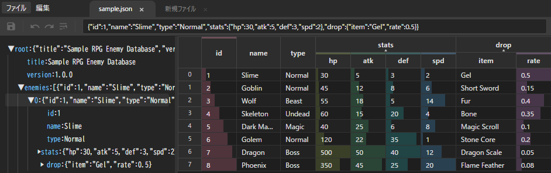

# JsonTreeGrid

**[▶ ブラウザで開く](https://napiiey.github.io/JsonTreeGrid/)**

JSONファイルをスプレッドシート風のグリッドとツリーで視覚的に編集できるブラウザアプリです。サーバー不要で、ブラウザだけで動作します。



## 特徴

- **ツリー + グリッド表示** — 左パネルでJSON構造をツリー表示、右パネルで配列やオブジェクトをグリッド編集
- **ネスト / フラット切替** — ネストされたオブジェクトをヘッダー上で展開・折りたたみ
- **データバー** — 数値列にインラインのバーチャートを表示し、値の大小を視覚的に比較
- **範囲選択** — ドラッグやShift+クリックでセルを範囲選択（スプレッドシートと同じ操作感）
- **インライン編集** — ダブルクリックまたはEnterキーでセルを直接編集
- **ドラッグ並べ替え** — 行インデックスのドラッグで行の並べ替え、ヘッダーのドラッグで列の並べ替え
- **Undo / Redo** — 完全な操作履歴（Ctrl+Z / Ctrl+Y）
- **カット / コピー / ペースト** — システムクリップボード経由で他アプリとの連携も可能
- **マルチタブ** — 複数のJSONファイルをタブで同時に開ける
- **ファイルドラッグ＆ドロップ** — `.json` ファイルをウィンドウにドロップして新しいタブで開く
- **コンテキストメニュー** — ヘッダーや行インデックスを右クリックで列・行の挿入/削除
- **列リサイズ** — 列の境界をドラッグして幅を調整
- **テキスト折り返し** — 選択列のテキスト折り返しを切り替え
- **ダークテーマ** — モダンなダークUI
- **依存ライブラリなし** — HTML / CSS / JavaScript のみ（ビルドツールにViteを使用）

## 使い方

1. **[こちら](https://napiiey.github.io/JsonTreeGrid/)** をブラウザで開く
2. JSONファイルをドラッグ＆ドロップ、または「ファイル → 開く」で読み込む
3. ツリーで配列やオブジェクトを選択するとグリッドに表示される
4. セルをダブルクリックまたはEnterで編集、Ctrl+Sで保存

> **注意**: ファイルの保存機能はChromium系ブラウザ（Chrome, Edge）で動作します。

## キーボードショートカット

| ショートカット | 操作 |
|---|---|
| `Ctrl + Z` | 元に戻す |
| `Ctrl + Y` | やり直し |
| `Ctrl + X` | 切り取り |
| `Ctrl + C` | コピー |
| `Ctrl + V` | 貼り付け |
| `Delete` | 選択セルを削除 |
| `Enter` | セルを編集 |
| `Escape` | 編集をキャンセル |
| `矢印キー` | 選択を移動 |
| `Shift + 矢印` | 選択範囲を拡大 |
| `Ctrl + O` | ファイルを開く |
| `Ctrl + S` | 保存 |
| `Ctrl + Shift + S` | 名前を付けて保存 |

## 技術スタック

- **Vite** — 開発サーバー＆ビルドツール
- **Vanilla JS** — フレームワーク依存なし
- **File System Access API** — ローカルファイルの直接読み書き（Chromium系ブラウザ）

## 開発

```bash
npm install
npm run dev     # 開発サーバー起動
npm run build   # dist/ にビルド出力
```

## ライセンス

MIT
